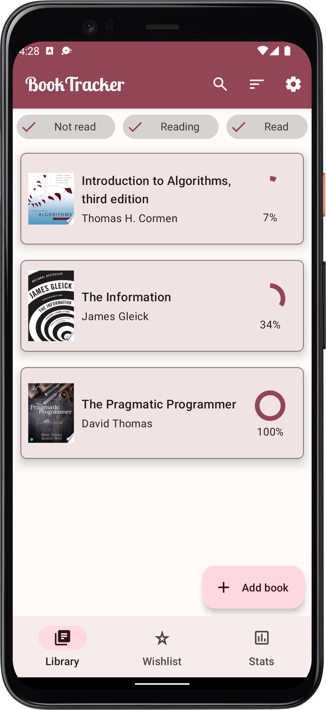
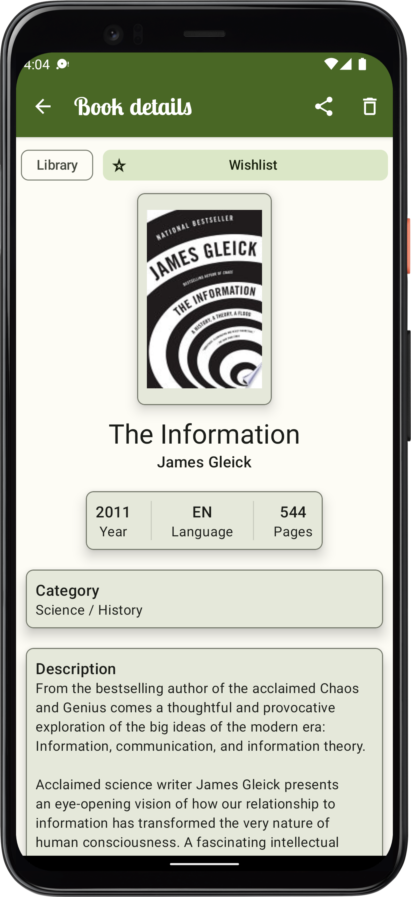
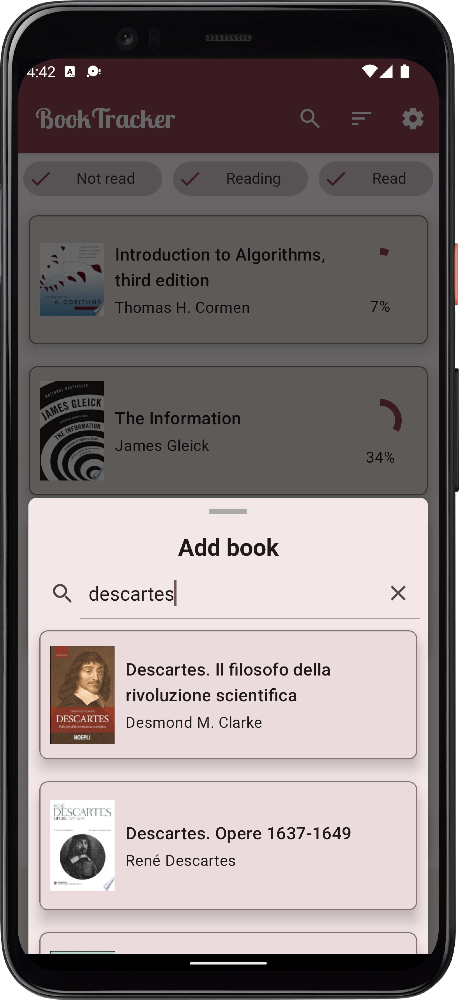

# BookTracker
BookTracker is an [Android 12L](https://developer.android.com/about/versions/12/12L?hl=en) app that allows the user to track his book readings and wishlists. 

This app has been developed exploiting the meain features of Material Design 3 (https://m3.material.io/).

## Screenshots

  
   
  

## Testing
The app has been tested on the following devices:
- Pixel 2 API 32 (phone)
- Pixel C API 32 (tablet)

## Notes
- Unlike physical devices, in emulators, Material Design 3 features are available from the Android 12L version (API 32);
- In Android version 12 (API 31), the application splash screen is shown only when the application is launched manually from the launcher.
